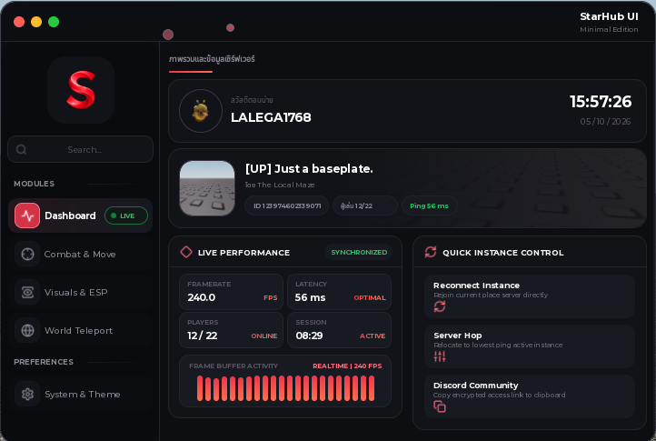

<div align="center">

# 🌟 StarHub UI | Developer Documentation & API Guide

**The Ultimate Modern Glassmorphism Roblox UI Library**  
*Tactile Apple iOS Bubble Audio • 7 Background Particle Modes • Obsidian Glass Pebble Toggle*

<br/>



<br/>

[](https://roblox.com)
[](https://luau.org)
[](https://github.com/STARLARP/StarHub-UI)
[](LICENSE)

</div>

---

> [!WARNING]
> **StarHub UI** is currently in active development. Performance optimizations and components are regularly updated. Please report bugs or submit feature requests through GitHub Issues.

> [!NOTE]
> Designed for maximum elegance and fluid 240+ FPS performance across PC, Mobile, and Tablet with automatic responsive scaling and zero emoji pollution.

---

## 📑 Table of Contents

- [🚀 Getting Started](#-getting-started)
  - [Installation (Loadstring)](#installation-loadstring)
  - [Basic Setup](#basic-setup)
- [📚 Documentation & API](#-documentation--api)
  - [1. Creating the Window](#1-creating-the-window)
  - [2. Navigation Headers & Tabs](#2-navigation-headers--tabs)
  - [3. GroupBoxes (2-Column Grid)](#3-groupboxes-2-column-grid)
  - [4. Toggles](#4-toggles)
  - [5. Sliders](#5-sliders)
  - [6. Dropdowns](#6-dropdowns)
  - [7. Action Rows (Buttons)](#7-action-rows-buttons)
  - [8. Danger Buttons](#8-danger-buttons)
  - [9. Mode Selectors](#9-mode-selectors)
  - [10. Keybinds](#10-keybinds)
  - [11. Text Inputs](#11-text-inputs)
  - [12. Color Pickers](#12-color-pickers)
  - [13. Dynamic Island Notifications](#13-dynamic-island-notifications)
  - [14. Built-in Dashboard & Settings](#14-built-in-dashboard--settings)
  - [15. Auto-Save Configuration Engine](#15-auto-save-configuration-engine)
- [🎨 Built-in Color Themes](#-built-in-color-themes)
- [🌌 7 Background Particle Modes](#-7-background-particle-modes)
- [🫧 Apple iOS Bubble Audio System](#-apple-ios-bubble-audio-system)
- [🌟 Credits](#-credits)
- [📄 License](#-license)

---

## 🚀 Getting Started

### Installation (Loadstring)

Load the library into your script executor using `loadstring`:

```lua
local StarHubUI = loadstring(game:HttpGet("https://raw.githubusercontent.com/STARLARP/StarHub-UI/main/StarHubUI.lua"))()
```

### Basic Setup

Here is a quick starter example demonstrating how to initialize a window, create navigation tabs, and add interactive controls:

```lua
local StarHubUI = loadstring(game:HttpGet("https://raw.githubusercontent.com/STARLARP/StarHub-UI/main/StarHubUI.lua"))()

-- 1. Create Window
local Window = StarHubUI:CreateWindow({
    Title = "StarHub UI",
    SubTitle = "Standard Edition",
    Size = UDim2.new(0, 720, 0, 485),
    ToggleKey = Enum.KeyCode.RightControl
})

-- 2. Add Navigation
Window:AddNavHeader("MODULES", 1)

local MainTab = Window:CreateTab({
    Title = "Combat",
    IconId = StarHubUI.Icons.Combat,
    BadgeText = "V1",
    LayoutOrder = 2
})

-- 3. Add GroupBox & Toggle
local AimBox = MainTab:CreateGroupBox("Left", "AIMBOT ENGINE", "ACTIVE", StarHubUI.Icons.Combat)

AimBox:AddToggle("Aimbot Tracking", "Locks crosshair to target head", false, function(state)
    print("Aimbot:", state)
end)
```

---

## 📚 Documentation & API

### 1. Creating the Window

Initializes the main UI window frame, top titlebar, floating pebble toggle, and particle systems.

```lua
local Window = StarHubUI:CreateWindow({
    Title = "StarHub UI",                     -- Main title text
    SubTitle = "Minimal Edition",             -- Subtitle display text
    Size = UDim2.new(0, 720, 0, 485),         -- Window dimension
    ToggleKey = Enum.KeyCode.RightControl,    -- Hotkey to toggle UI visibility
    Logo = nil                                -- Optional custom logo URL or Decal ID
})
```

---

### 2. Navigation Headers & Tabs

Sidebar navigation is divided into categorised headers and interactive glass tabs.

#### Adding a Header

```lua
Window:AddNavHeader("MODULES", 1)
Window:AddNavHeader("PREFERENCES", 5)
```

#### Adding a Tab

```lua
local MyTab = Window:CreateTab({
    Title = "Main Features",
    IconId = StarHubUI.Icons.Zap,             -- Asset ID or icon from StarHubUI.Icons
    BadgeText = "NEW",                        -- Optional badge text (e.g. "LIVE", "NEW")
    LayoutOrder = 2                           -- Numerical sorting order
})
```

---

### 3. GroupBoxes (2-Column Grid)

GroupBoxes hold your interactive elements in an elegant 2-column layout (`"Left"` or `"Right"`).

```lua
local LeftBox = MyTab:CreateGroupBox(
    "Left",                                   -- Column: "Left" or "Right"
    "AUTOMATION MODULES",                     -- Box Header Title
    "AUTO",                                   -- Optional Header Badge Text
    StarHubUI.Icons.Zap                       -- Optional Box Header Icon
)

local RightBox = MyTab:CreateGroupBox(
    "Right", 
    "PLAYER MODIFIERS", 
    "STATS", 
    StarHubUI.Icons.Combat
)
```

---

### 4. Toggles

Interactive switch with smooth spring animations, iOS Bubble audio feedback, and multi-line word wrapping.

```lua
LeftBox:AddToggle(
    "Auto Farm Coins",                        -- Component Title
    "Automatically sweeps and collects coins",-- Subtitle description
    false,                                    -- Default state (true / false)
    function(state)                           -- Callback function
        print("Toggle state changed to:", state)
    end
)
```

---

### 5. Sliders

Smooth draggable sliders with numeric input and unit labels.

```lua
LeftBox:AddSlider(
    "WalkSpeed Multiplier",                   -- Component Title
    16,                                       -- Minimum value
    250,                                      -- Maximum value
    32,                                       -- Default value
    "SPD",                                    -- Unit label text (e.g. "FPS", "STUDS", "%")
    function(value)                           -- Callback function
        print("Slider value:", value)
    end
)
```

---

### 6. Dropdowns

Multi-item dropdown selector with chevron animations and bubble-tap sounds.

```lua
LeftBox:AddDropdown(
    "Target Hitbox",                          -- Component Title
    {"Head", "UpperTorso", "HumanoidRootPart"},-- Options array
    "Head",                                   -- Default selected item
    function(selected)                        -- Callback function
        print("Selected Hitbox:", selected)
    end
)
```

---

### 7. Action Rows (Buttons)

Clean clickable button row with icon, title, and description.

```lua
RightBox:AddActionRow(
    "Reset Character",                        -- Button Title
    "Instantly respawns your local character",-- Subtitle description
    StarHubUI.Icons.Refresh,                  -- Icon asset ID
    function()                                -- Callback function
        local char = game.Players.LocalPlayer.Character
        if char and char:FindFirstChildOfClass("Humanoid") then
            char:FindFirstChildOfClass("Humanoid").Health = 0
        end
    end
)
```

---

### 8. Danger Buttons

Red accented high-priority danger action button with a warning indicator.

```lua
RightBox:AddDangerButton(
    "Emergency Panic",                        -- Button Title
    "Immediately unloads UI and hooks",       -- Subtitle description
    StarHubUI.Icons.Skull,                    -- Icon asset ID
    function()                                -- Callback function
        print("Panic button activated!")
    end
)
```

---

### 9. Mode Selectors

Pill-style segmented button switch for selecting between multiple modes.

```lua
RightBox:AddModeSelector(
    "KEYBIND MODE",                           -- Component Title
    {"Toggle", "Hold", "Always"},             -- Options array
    "Toggle",                                 -- Default option
    function(selectedMode)                    -- Callback function
        print("Active mode:", selectedMode)
    end
)
```

---

### 10. Keybinds

Customizable keybind listener with automatic input capture.

```lua
RightBox:AddKeybind(
    "Aimbot Lock Key",                        -- Component Title
    Enum.KeyCode.E,                           -- Default KeyCode
    function(inputObject)                     -- Callback function
        print("Keybind updated to:", inputObject.KeyCode.Name)
    end
)
```

---

### 11. Text Inputs

Sleek glass text input field with placeholder text and instant callback.

```lua
RightBox:AddInput(
    "Custom Webhook URL",                     -- Component Title
    "https://discord.com/api/webhooks/...",   -- Placeholder string
    "",                                       -- Default initial text
    function(text)                            -- Callback function
        print("Input text:", text)
    end
)
```

---

### 12. Color Pickers

Interactive color selector with live swatch preview.

```lua
LeftBox:AddColorPicker(
    "ESP Glow Color",                         -- Component Title
    Color3.fromRGB(0, 255, 140),              -- Default Color3
    function(color)                           -- Callback function
        print("Selected Color:", color)
    end
)
```

---

### 13. Dynamic Island Notifications

Pill-shaped glass notifications anchored at the top-center with guaranteed auto-dismiss timeouts.

```lua
StarHubUI:Notify({
    Title = "MISSION COMPLETED",              -- Notification Title
    Content = "All target entities defeated!", -- Notification Message
    Duration = 4,                             -- Auto-dismiss delay in seconds (default 4)
    Badge = "ALERT",                          -- Optional pill badge text
    Icon = StarHubUI.Icons.Bell               -- Optional icon asset ID
})
```

---

### 14. Built-in Dashboard & Settings

StarHub UI comes with pre-engineered, dual-column Dashboard and Settings tabs ready to plug in with a single function call:

#### Pre-built Dashboard (Overview + Real-Time Hardware & Server Info)

```lua
local DashTab = Window:CreateTab({
    Title = "Dashboard",
    IconId = StarHubUI.Icons.Dashboard,
    BadgeText = "LIVE",
    LayoutOrder = 2
})
Window:CreateDualColumnDashboard(DashTab)
```

#### Pre-built Settings Tab (Theme Chooser, Background Effects, Audio Controls)

```lua
Window:AddNavHeader("PREFERENCES", 6)

local SettingsTab = Window:CreateTab({
    Title = "System & Theme",
    IconId = StarHubUI.Icons.Settings,
    LayoutOrder = 7
})
Window:CreateDualColumnSettings(SettingsTab)
```

---

### 15. Auto-Save Configuration Engine

StarHub UI is equipped with an integrated real-time auto-saving and auto-loading configuration system. Any customization you make—such as changing themes, picking custom gradient colors, toggling background effects, adjusting sound volume, or changing keybinds—is debounced and serialized directly to `StarHubUI_Config.json` on your executor.

#### Key Highlights
- **Real-Time Auto-Save**: Automatically triggers whenever settings are modified (with a `0.35s` debounce to eliminate disk stuttering during slider dragging).
- **Instant Auto-Load**: Seamlessly restores your themes, custom hex colors, particle effects, transparency, and hotkeys the moment the UI starts.
- **Color Serialization**: Automatically converts Luau `Color3` objects into standard `#RRGGBB` hex strings for lossless JSON storage and deserialization.
- **In-Game Settings Control**: Toggle `REAL-TIME AUTO SAVE` on or off, click `Save UI Settings` for an immediate write, or press `Reset All Settings` to wipe the configuration and restore factory defaults.

#### Code API

```lua
-- Manually save all active settings to StarHubUI_Config.json
StarHubUI:SaveConfig()

-- Manually load and re-apply settings from StarHubUI_Config.json
StarHubUI:LoadConfig()

-- Trigger debounced auto-saving (0.35s delay)
StarHubUI:AutoSave()
```

---

## 🎨 Built-in Color Themes

StarHub UI includes 10 pre-configured vibrant themes that update the interface dynamically in real-time:

| Theme Name | Primary Accent Color |
| :--- | :--- |
| `NeverloseCrimson` | Neon Crimson Red (`#EB374B`) |
| `EmeraldCyber` | Neon Mint / Emerald Green (`#00F59B`) |
| `ElectricViolet` | Vivid Cyber Violet (`#A855F7`) |
| `MidnightGold` | Luxury Amber Gold (`#F59E0B`) |
| `SakuraBlossom` | Soft Blossom Pink (`#F472B6`) |
| `ArcticCyan` | Frost Electric Cyan (`#06B6D4`) |
| `SunsetTangerine` | Neon Radiant Orange (`#FB923C`) |
| `GhostMonochrome` | Clean Frost White (`#F8FAFC`) |
| `DeepOcean` | Deep Royal Sapphire (`#3B82F6`) |
| `ToxicLime` | Hyper Vibrant Lime (`#84CC16`) |

---

## 🌌 7 Background Particle Modes

Choose between 7 GPU-efficient background modes directly from the Settings tab or via code:

1. **`Floating Bubbles`** — Translucent neon bubbles with specular highlights floating upward with gentle sine-wave swaying.
2. **`Matrix Cyber Rain`** — 16 vertical columns of streaming cybernetic digital rain codes.
3. **`Starlight Fireflies`** — Organic fireflies and starlight dust floating smoothly in 2D compound vectors.
4. **`Fire Embers`** — Fiery glowing sparks rising with lifelike micro-jitter.
5. **`Snowfall Drift`** — Soft winter flakes drifting downward with simulated wind gust physics.
6. **`Subtle Ambient Glow`** — Standalone dual-point aurora nebula smoothly breathing in opposing corners.
7. **`Off (Clean Minimal)`** — Completely disables particles for clean aesthetics and maximum 240+ FPS competitive framerates.

---

## 🍎 Apple iOS Bubble Audio System

StarHub UI is powered by the **Apple iOS Bubble Audio Engine** (`rbxassetid://6895079853`):
- **Click**: Warm, rounded bubble pop (`Pitch: 1.10`)
- **Toggle On**: Playful ascending bubble pop (`Pitch: 1.40`)
- **Toggle Off**: Gentle descending bubble pop (`Pitch: 0.88`)
- **Tab Switch**: Crisp haptic bubble tap (`Pitch: 1.25`)
- **Dropdown**: Neutral bubble pop (`Pitch: 1.00`)
- **Notify**: Melodic chime notification (`Pitch: 1.35`)

Audio can be toggled on/off or adjusted from 0% to 100% volume in the **Audio & Haptics** section in Settings.

---

## 🌟 Credits

- **UI Framework & Design**: Developed by **STARLARP**
- **Inspiration**: Fluent Design System, Neverlose V2, Apple VisionOS
- **Icons**: Lucide Icons, Solar Icons, Craft Icons
- **Audio FX**: Apple iOS Haptic Sound Engine

---

## 📄 License

This project is licensed under the [MIT License](LICENSE).
